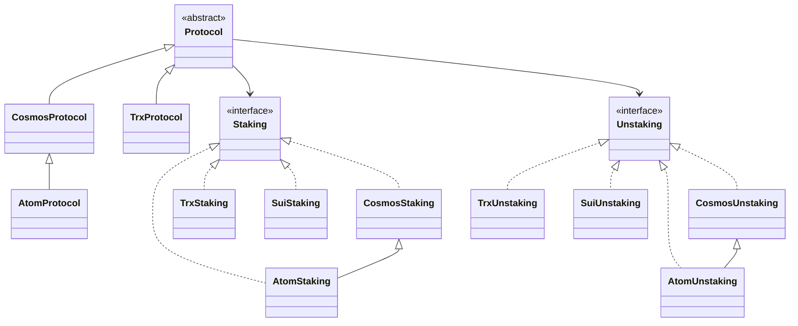
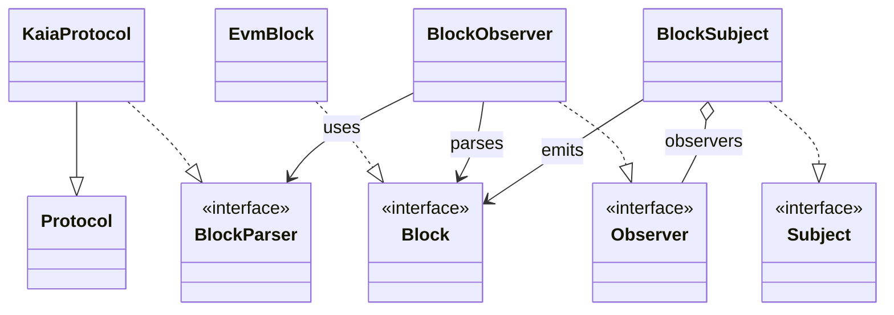

## protocol-pattern 스터디
* 디자인 패턴 적용 v0.1
  * 스트레티지 패턴 Staking, Unstking 행동을 분리하여 위임

* 디자인 패턴 적용 v0.2
  * Observer 패턴으로 블록 조회, 파싱 로직 분리
  * !! 블록 조회 입출금 파싱에 사용하려고 했지만 하나의 subject에 하나의 Observer가 결합되는 일대일 구조여서 우선 필요없을듯
