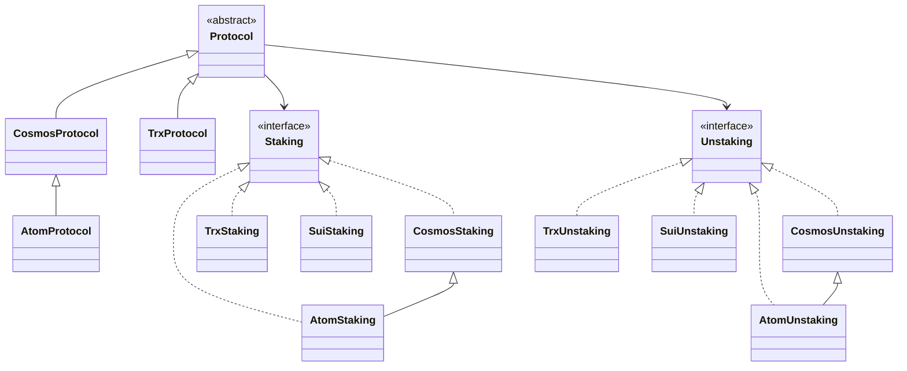

## protocol-pattern 스터디
* 디자인 패턴 적용 v0.1
  * 스트레티지 패턴 Staking, Unstking 행동을 분리하여 위임

```mermaid
classDiagram
    class Protocol{
        <<abstract>>
    }
    class CosmosProtocol
    class AtomProtocol
    class TrxProtocol

    class Staking {
        <<interface>>
    }
    class CosmosStaking
    class AtomStaking
    class TrxStaking
    class SuiStaking

    class Unstaking {
        <<interface>>
    }
    class CosmosUnstaking
    class AtomUnstaking
    class TrxUnstaking
    class SuiUnstaking

    Protocol <|-- CosmosProtocol
    Protocol <|-- TrxProtocol
    CosmosProtocol <|-- AtomProtocol
    
    Staking <|.. CosmosStaking
    Staking <|.. AtomStaking
    Staking <|.. TrxStaking
    Staking <|.. SuiStaking

    CosmosStaking <|-- AtomStaking

    Unstaking <|.. CosmosUnstaking
    Unstaking <|.. AtomUnstaking
    Unstaking <|.. TrxUnstaking
    Unstaking <|.. SuiUnstaking
  
    CosmosUnstaking <|-- AtomUnstaking
    

    Protocol --> Staking
    Protocol --> Unstaking
```